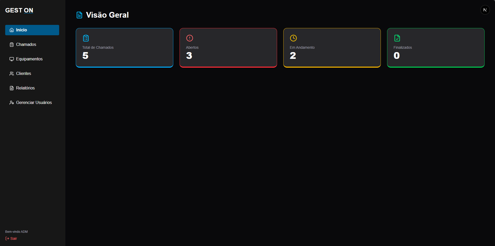

# 🛠️ GEST ON - Sistema de Gerenciamento Técnico

**GEST ON** é uma aplicação web desenvolvida para empresas de manutenção de computadores e impressoras. A plataforma oferece um painel completo para gerenciar clientes, equipamentos, chamados técnicos, problemas reportados e soluções aplicadas.

## 🚀 Tecnologias Utilizadas

- **Next.js** — Framework React para aplicações web modernas
- **React.js** — Interface declarativa e baseada em componentes
- **TypeScript** — Tipagem estática para maior robustez no código
- **Tailwind CSS** — Estilização rápida e responsiva com classes utilitárias
- **Supabase** — Backend as a Service com autenticação e banco de dados PostgreSQL
- **Neon PostgreSQL** — Banco de dados em nuvem performático
- **Prisma ORM** — Mapeamento objeto-relacional moderno e intuitivo

---

## 🎯 Objetivo

Automatizar e facilitar o gerenciamento de ordens de serviço (OS) em empresas de suporte técnico, oferecendo:

- Cadastro e gerenciamento de **clientes e equipamentos**
- Registro de **chamados técnicos** com controle de status
- Associação de **problemas e soluções** por equipamento
- **Controle de permissões** por tipo de usuário (admin, técnico, atendente)
- Interface **moderna, responsiva e intuitiva**

---

## 💡 Paradigmas Utilizados

### 🔹 Programação Orientada a Componentes (POC)
Com React e Next.js, toda a interface é construída a partir de componentes reutilizáveis, promovendo escalabilidade e organização.

### 🔹 Programação Declarativa
O uso de JSX e Tailwind permite descrever diretamente o que a interface deve exibir, melhorando a clareza e manutenção do código.

---

## ✅ Funcionalidades

- 🔐 Autenticação via Supabase com controle de tipo de usuário  
- 🧑‍💼 Dashboard com visualização de chamados por cliente, técnico ou status  
- 🖥️ Registro detalhado de equipamentos e histórico de reparos  
- 🔍 Filtros por status, técnico, data e cliente  
- ⚙️ Página de administração de usuários (admin-only)  

---

## 📸 Capturas de Tela

---
## 📁 Estrutura de Pastas (resumida)

gest-on/
├── prisma/                  → Schema do banco (Prisma)
├── public/                  → Assets estáticos
├── src/
│   ├── pages/               → Páginas da aplicação (Next.js)
│   ├── components/          → Componentes reutilizáveis
│   ├── lib/                 → Integração com Supabase e Prisma
│   ├── styles/              → Arquivos de estilo global
│   └── types/               → Tipagens globais TypeScript
├── .env.local               → Variáveis de ambiente
├── package.json
└── README.md

## 🛠️ Como executar localmente

## -Instale as dependências 
npm install

## -Crie o arquivo .env.local, as variáveis corretas estarão dentro do arquivo.txt "arquivoEnvConfig.txt" no diretorio principal.
apenas copie os dados do arquivo txt e cole no .env.local

## - Gere o cliente Prisma (para garantir que o Prisma esteja sincronizado com o banco)
npx prisma generate

## -Aplique o schema no banco (caso tenha alterações no Prisma schema)
npx prisma db push

## -Inicie o servidor
npm run dev

## -Abra o navegador e acesse
http://localhost:3000
