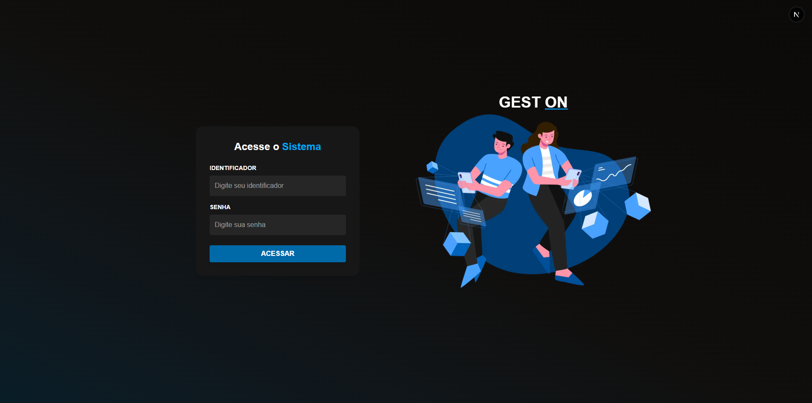

# 🛠️ GEST ON - Sistema de Gerenciamento Técnico

**GEST ON** é uma aplicação web desenvolvida para empresas de manutenção de computadores e impressoras. A plataforma oferece um painel completo para gerenciar clientes, equipamentos, chamados técnicos, problemas reportados e soluções aplicadas.

## 🚀 Tecnologias Utilizadas

- **Next.js** — Framework React para aplicações web modernas
- **React.js** — Interface declarativa e baseada em componentes
- **TypeScript** — Tipagem estática para maior robustez no código
- **Tailwind CSS** — Estilização rápida e responsiva com classes utilitárias
- **Supabase** — Backend as a Service com autenticação e banco de dados PostgreSQL
- **Neon PostgreSQL** — Banco de dados em nuvem performático
- **Prisma ORM** — Mapeamento objeto-relacional moderno e intuitivo

---

## 🎯 Objetivo

Automatizar e facilitar o gerenciamento de ordens de serviço (OS) em empresas de suporte técnico, oferecendo:

- Cadastro e gerenciamento de **clientes e equipamentos**
- Registro de **chamados técnicos** com controle de status
- Associação de **problemas e soluções** por equipamento
- **Controle de permissões** por tipo de usuário (admin, técnico, atendente)
- Interface **moderna, responsiva e intuitiva**

---

## 💡 Paradigmas Utilizados

### 🔹 Programação Orientada a Componentes (POC)
Com React e Next.js, toda a interface é construída a partir de componentes reutilizáveis, promovendo escalabilidade e organização.

### 🔹 Programação Declarativa
O uso de JSX e Tailwind permite descrever diretamente o que a interface deve exibir, melhorando a clareza e manutenção do código.

---

## ✅ Funcionalidades

- 🔐 Autenticação via Supabase com controle de tipo de usuário  
- 🧑‍💼 Dashboard com visualização de chamados por cliente, técnico ou status  
- 🖥️ Registro detalhado de equipamentos e histórico de reparos  
- 🔍 Filtros por status, técnico, data e cliente  
- ⚙️ Página de administração de usuários (admin-only)  

---

## 📸 Capturas de Tela

---

## 🛠️ Como Executar Localmente

- Baixe o projeto e extraia na pasta do usuário principal da máquina, em seguida abra o projeto.

- Instale as dependências  
npm install

- Crie o arquivo .env, as variáveis corretas estarão dentro do arquivo "arquivoEnvConfig.txt" no diretório principal.  
Apenas copie os dados do arquivo txt e cole no .env

- Gere o cliente Prisma (para garantir que o Prisma esteja sincronizado com o banco)  
npx prisma generate

- Aplique o schema no banco (caso tenha alterações no Prisma schema)  
npx prisma db push

- Inicie o servidor  
npm run dev

- Abra o navegador e acesse  
http://localhost:3000

- Faça o login padrão
O identificador será "1" e a senha padrão será "123"
